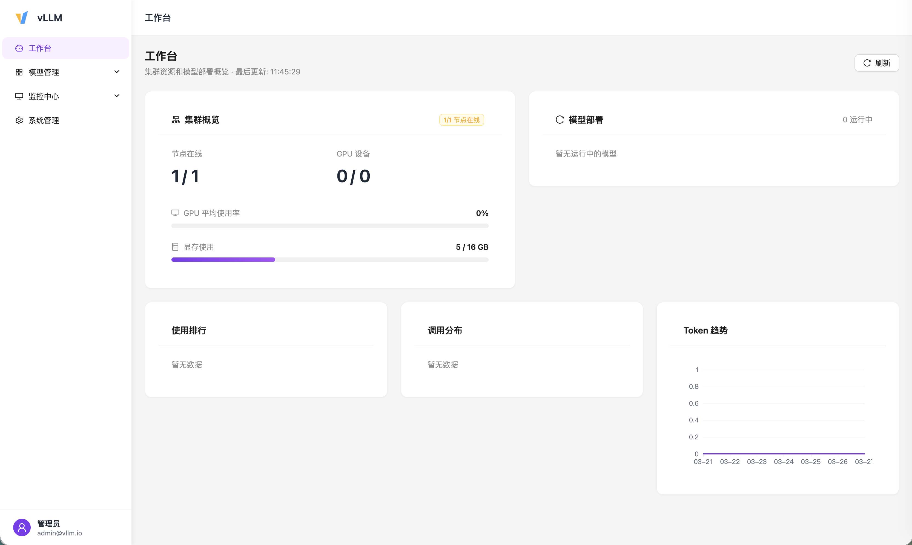
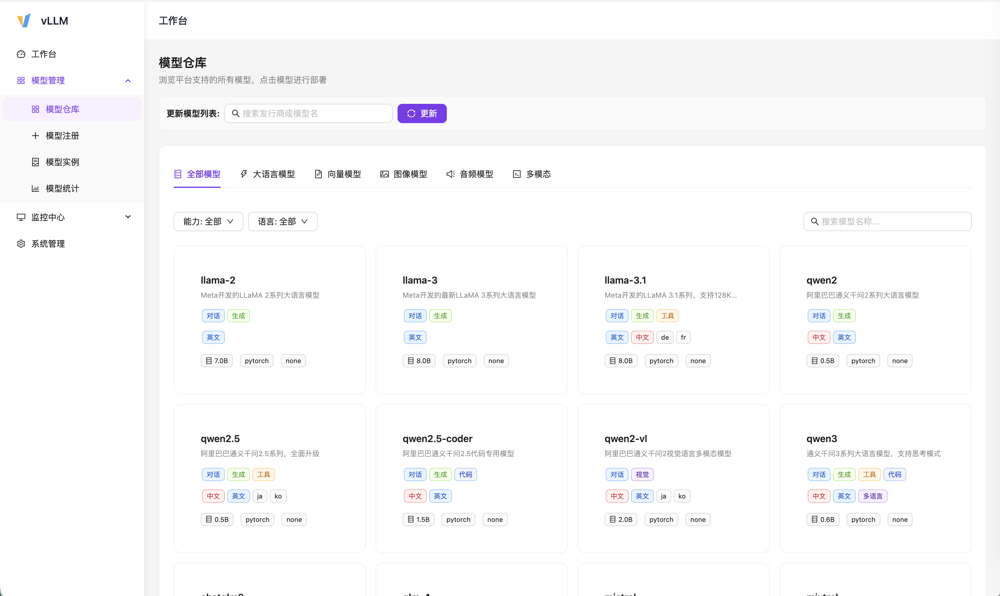
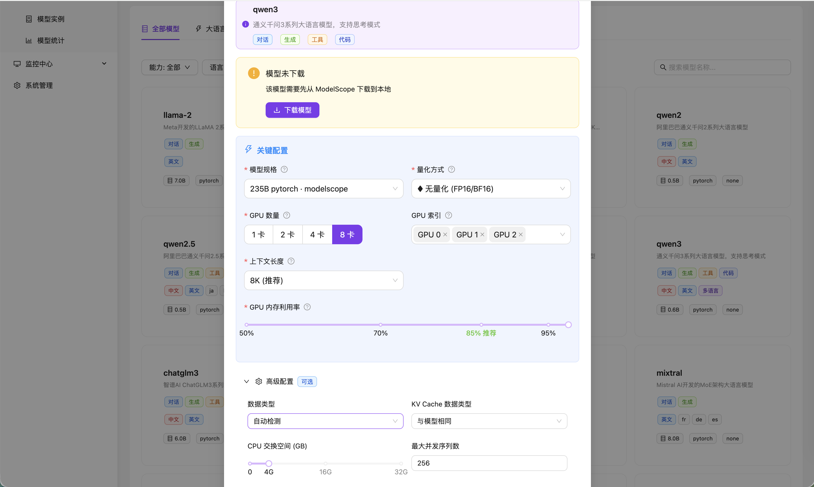
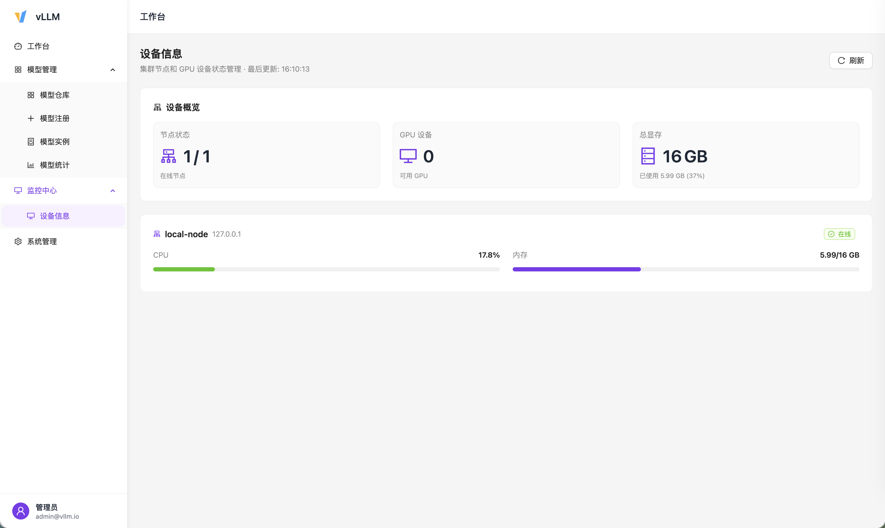

# vLLM Manager

<p align="center">
  
  
  
  
  
  
  
</p>

<p align="center">
  <b>基于 vLLM 的大语言模型部署与管理平台</b>
</p>

<p align="center">
  <a href="#-简介">简介</a> •
  <a href="#-功能特性">功能特性</a> •
  <a href="#-快速开始">快速开始</a> •
  <a href="#-文档">文档</a> •
  <a href="#-技术栈">技术栈</a>
</p>

***

## 📖 简介

**vLLM Manager** 是一个开源的大语言模型（LLM）部署和管理平台，基于 [vLLM](https://github.com/vllm-project/vllm) 和 [ModelScope](https://www.modelscope.cn/) 构建。它提供了直观的 Web 界面，让用户可以轻松地搜索、下载、部署和管理各种开源大语言模型。

### 核心优势

| 特性               | 说明                                   |
| ---------------- | ------------------------------------ |
| 🚀 **一键部署**      | 支持从 ModelScope 直接下载并部署模型             |
| 🎯 **多模型支持**     | 支持 Qwen、LLaMA、ChatGLM、DeepSeek 等主流模型 |
| 📊 **实时监控**      | 实时查看 GPU 使用率、模型推理日志                  |
| 🔧 **灵活配置**      | 支持量化、GPU 分配、上下文长度等高级参数               |
| 🌐 **OpenAI 兼容** | 提供 OpenAI 兼容的 API 接口                 |
| 💻 **现代化 UI**    | 基于 React + Ant Design 的响应式界面         |
| 🗄️ **多数据库支持**   | 支持 SQLite、MySQL、PostgreSQL           |

***

## ✨ 功能特性

### 模型仓库

- 🔍 从 ModelScope 搜索和浏览模型
- 📥 支持模型一键下载和缓存管理
- 🏷️ 按发行商筛选（通义千问、智谱、DeepSeek 等）
- 📋 模型规格对比（参数量、量化方式、上下文长度）

### 模型部署

- ⚡ 一键部署 vLLM 推理服务
- 🎛️ 可视化配置 GPU、量化、上下文长度等参数
- 📜 实时查看模型启动日志（WebSocket 流式传输）
- 🔄 支持多实例管理和状态监控

### 监控统计

- 📈 GPU 使用率、显存占用实时监控
- 📊 模型调用统计（Token 消耗、延迟分布）
- 📉 请求成功率、错误类型分析
- 🗓️ 历史趋势图表

### 系统管理

- 👤 用户和角色管理
- 🔑 API Key 管理
- ⚙️ 系统配置
- 📝 操作日志

***

## 🚀 快速开始

### 环境要求

- **Python**: 3.12+
- **Node.js**: 18+
- **CUDA**: 11.8+ (推荐，用于 GPU 推理)

### 安装步骤

#### 1. 克隆仓库

```bash
git clone https://github.com/yourusername/vllm-manager.git
cd vllm-manager
```

#### 2. 后端安装

```bash
cd backend

# 创建虚拟环境
python3 -m venv venv
source venv/bin/activate  # Linux/Mac
# 或 venv\Scripts\activate  # Windows

# 安装依赖
pip install -r requirements.txt

# 启动后端服务
python3 -m uvicorn main:app --host 0.0.0.0 --port 8000 --reload
```

#### 3. 前端安装

```bash
cd ../frontend

# 安装依赖
npm install

# 启动开发服务器
npm run dev
```

#### 4. 访问应用

打开浏览器访问 <http://localhost:3000>

### Docker 部署

```bash
# 一键启动
docker-compose up -d

# 访问 http://localhost:3000
```

***

## ⚙️ 配置说明

### 数据库配置

支持 SQLite（默认）、MySQL 和 PostgreSQL。

**使用 MySQL:**

```bash
# 安装依赖
pip install pymysql

# 配置环境变量
export DB_TYPE=mysql
export MYSQL_HOST=localhost
export MYSQL_PORT=3306
export MYSQL_USER=vllm_user
export MYSQL_PASSWORD=your_password
export MYSQL_DATABASE=vllm_manager
```

更多配置选项请参考 [部署文档](docs/DEPLOYMENT.md)。

***

## 📚 文档

| 文档                                   | 说明              |
| ------------------------------------ | --------------- |
| [架构文档](docs/ARCHITECTURE.md)         | 项目架构和技术细节       |
| [部署文档](docs/DEPLOYMENT.md)           | 生产环境部署指南        |
| [API 文档](http://localhost:8000/docs) | Swagger UI 接口文档 |

***

## 🖼️ 界面预览

<table>
  <tr>
    <td></td>
    <td></td>
  </tr>
  <tr>
    <td align="center">仪表盘</td>
    <td align="center">模型仓库</td>
  </tr>
  <tr>
    <td></td>
    <td></td>
  </tr>
  <tr>
    <td align="center">模型部署</td>
    <td align="center">监控统计</td>
  </tr>
</table>

***

## 🏗️ 技术栈

### 后端

| 技术                                                             | 用途         |
| -------------------------------------------------------------- | ---------- |
| [FastAPI](https://fastapi.tiangolo.com/)                       | 高性能 Web 框架 |
| [SQLAlchemy](https://www.sqlalchemy.org/)                      | ORM 数据库管理  |
| [ModelScope SDK](https://www.modelscope.cn/)                   | 模型下载和管理    |
| [vLLM](https://github.com/vllm-project/vllm)                   | 高性能推理引擎    |
| [Pydantic](https://docs.pydantic.dev/)                         | 数据验证       |
| [WebSocket](https://fastapi.tiangolo.com/advanced/websockets/) | 实时日志推送     |

### 前端

| 技术                                            | 用途       |
| --------------------------------------------- | -------- |
| [React 18](https://react.dev/)                | UI 框架    |
| [TypeScript](https://www.typescriptlang.org/) | 类型安全     |
| [Vite](https://vitejs.dev/)                   | 构建工具     |
| [Ant Design 5](https://ant.design/)           | UI 组件库   |
| [Axios](https://axios-http.com/)              | HTTP 客户端 |
| [ECharts](https://echarts.apache.org/)        | 数据可视化    |
| [Zustand](https://github.com/pmndrs/zustand)  | 状态管理     |

***

## 🛣️ 路线图

- [x] 基础模型管理功能
- [x] vLLM 模型部署
- [x] 实时监控和日志
- [x] 多模型并发部署
- [x] 多数据库支持 (SQLite/MySQL/PostgreSQL)
- [ ] 模型微调支持
- [ ] 多节点集群管理
- [ ] 模型评测功能

***

## 🤝 贡献

我们欢迎所有形式的贡献！

### 贡献流程

1. Fork 本仓库
2. 创建特性分支 (`git checkout -b feature/AmazingFeature`)
3. 提交更改 (`git commit -m 'Add some AmazingFeature'`)
4. 推送到分支 (`git push origin feature/AmazingFeature`)
5. 创建 Pull Request

### 开发规范

- 遵循 PEP 8 代码规范（Python）
- 使用 ESLint 检查代码（TypeScript）
- 提交前运行测试
- 更新相关文档

***

## 📄 许可证

本项目采用 [MIT](LICENSE) 许可证开源。

***

## 🙏 致谢

- [vLLM](https://github.com/vllm-project/vllm) - 高性能推理引擎
- [ModelScope](https://www.modelscope.cn/) - 模型社区
- [FastAPI](https://fastapi.tiangolo.com/) - Web 框架
- [Ant Design](https://ant.design/) - UI 组件库

***

<p align="center">
  如果这个项目对你有帮助，请给我们一个 ⭐️ Star！
</p>
